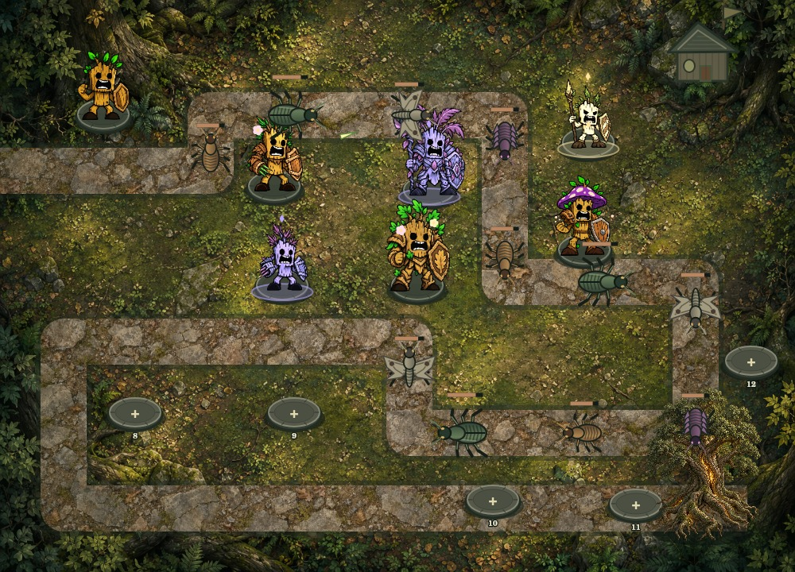
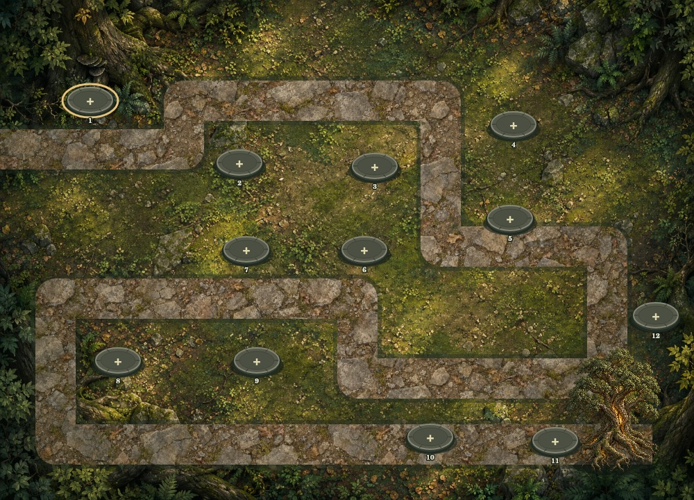
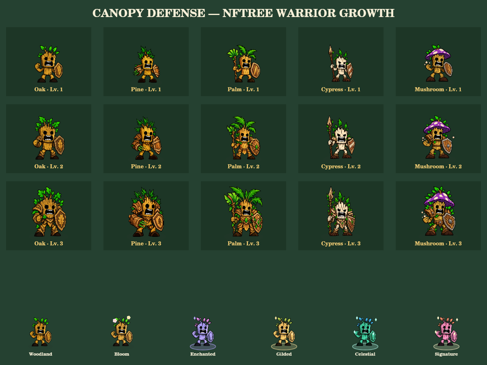

# Canopy Defense

**Build your forest. Defend the Tree of Life.**

A playable, mobile-friendly tower-defense prototype for the TREE Arcade.

## Status

This repository contains the **development preview**, not a mainnet launch. NFTree ownership and TREE purchases are explicitly simulated. It connects no wallet, sends no transactions, transfers no tokens, and awards no money or token rewards. Preview ownership, balances, and scores are editable browser data.

## Play locally

Install Node.js 20 or later, open a terminal in this repository, and run:

```sh
npm start
```

Open **http://127.0.0.1:5173**. No dependency installation is required. Keep the terminal running while you play. Use Ctrl+C to stop it.

**Optional Windows shortcut:** for the existing clone at `D:\Finance\Crypto\Repos\treetowerdefense`, download [Launch-Canopy-Defense.cmd](Launch-Canopy-Defense.cmd) to **Downloads** and double-click it. It updates the clean `main` branch, starts the preview, and opens your default browser. No PowerShell commands or dependency installation are needed; Git for Windows and Node.js 20+ must be installed. After updating, the copy inside your clone also works by double-clicking it.

The launcher stops before updating if there are local edits, untracked files, a different branch or origin, or local commits outside `origin/main`. It never stashes, resets, force-updates, or switches branches. Move or commit local work before retrying. Keep a first downloaded copy outside the clone so it does not become an untracked file that blocks its own update.

It always uses **http://127.0.0.1:5173** to keep browser saves on the same origin. An existing server is reused only if all game source, styles, and image bytes match this clone. An unrelated or stale server is left running: stop it yourself with Ctrl+C in its original window, then retry. Keep a newly opened preview window running while playing. If browser opening fails, open the printed address manually. Refresh an already-open game tab after updating; the launcher does not modify browser saves. `npm run preview` opens/checks the current build without updating Git.

The server binds to localhost by default and serves only game assets. Do not double-click `index.html`; browser module loading requires the local server. `PORT` and `HOST` can be set explicitly for development.

## Fantasy forest build · v0.9

- Per-guardian targeting orders: **First** follows route progress, **Strongest** focuses remaining health, and **Fastest** responds to actual movement speed including slows. The inspector provides touch/keyboard controls; aiming and attacks share the choice. Orders are included, remain with a saved/continued run, and do not change growth prices. See [guardian targeting and playtest notes](docs/guardian-targeting.md).
- Deliberate opening waves: termites first, armored beetles in wave 2, fast moths in wave 3, blight in wave 4, and combined pressure in wave 5. Named scouting briefs and wave-start notices explain each threat. Spawn spacing gives armor a measured introduction, then narrows through later waves. Beetles have clearer armor plates and blight pests have larger silhouettes. See [wave balance and simulation results](docs/wave-balance.md).
- Guardians now face targets in eight directions using front, side, and rear poses at all three growth levels. Shots leave calibrated gauntlet, staff, spear, or casting-hand points; Oak sends a shockwave from the roots. Firing poses hold while their projectile finishes, including the final killing shot. See [directional art and verification notes](docs/guardian-aiming.md).
- Clearer combat feedback: brief pest hit reactions, impact rings, collapsing/fading defeat silhouettes, dust, and Tree of Life damage or shield messages.
- Wave start/clear notices, an advance warning for the final wave, an arrival warning when the Blight King actually spawns, and a persistent boss health display. See [combat feedback and verification notes](docs/combat-feedback.md).
- Effects hold during pause, dialogs, and hidden tabs. Reduced-motion mode omits impact motion and hit tinting; transient effects never enter saves or change battle rules.
- A **Coming later** concept gallery below the battlefield: Archer Watchtower, Sap Cannon, Thorn Bastion, and Root Obelisk. These structures preview future ideas and are not available to build or purchase. See [tower artwork and generation prompts](docs/future-towers.md).
- Mature fantasy forest terrain, a textured stone route, engraved build foundations, and an ancient Tree of Life with no face.
- Segmented insect pests with armor, mandibles, wings, and a horned Blight King. They turn with the route; combat statistics are unchanged.
- Larger guardian portraits and battlefield silhouettes, a restrained UI palette, and clearer text against textured terrain.
- A four-step guided start with suggested Pine/Oak placements, highlighted sites, optional skip, and restart from Field Guide. The recommended first wave uses earned Sap only.
- Next-wave scouting with pest portraits, counts, traits, and defense tips; its forecast shares the exact battle lineup.
- Purchase reviews for every TREE upgrade, supply, and continue, showing effect, cost, and remaining balance before confirmation. Canceling never charges. Battle time waits during review.
- Three campaign chapters: **Emerald Crossing**, **Sunpetal Meadow**, and **Moonlit Marsh**. The winding route is shared; each chapter changes the biome and pest difficulty.
- Ten waves per chapter, four expressive pest types, and a final **Blight King** boss.
- Five defenders: Oak splash damage, Pine rapid fire, Palm slowing, Cypress piercing, Mushroom poison.
- A prominent textured forest battlefield with NFTree-style stump warriors, idle movement, directional firing poses, marching pests, visible tower growth, distinct attack effects, and optional synthesized sound (off by default).
- Planting sites, automatic targeting, range previews, three permanent species levels, supplies, victory, and defeat.
- Grow each defender species from **Sapling → Guardian → Ancient**. A TREE upgrade improves every current and future defender of that species.
- Chapters unlock in order. Earn 1–3 stars from remaining health, grow the Tree of Life, and add permanent landmarks: an arborist cottage, flower garden, and lily pond.
- A simulated NFTree gate, rarity selector, six cosmetic themes, cumulative rarity unlocks, and per-tower customization.
- TREE-priced upgrades, Root Shield, Fertilizer, Leaf Storm, and a continue that preserves the current wave and towers.
- Earned **Sap** for ordinary tower planting; defeating pests and clearing waves earns more Sap.
- Desktop pointer/keyboard controls and mobile touch controls, including labeled build-site buttons.
- Local save/resume. Reloading restores a running battle **paused**. Switching tabs also pauses battle.

## Agreed game model

| Feature | Requirement |
| --- | --- |
| Game and seasonal access | Own an NFTree |
| Start a fresh run | Included with ownership |
| Supplies | TREE |
| Upgrades | TREE |
| Continues | TREE |
| Rarity cosmetics | Included with the qualifying NFTree |

There is no SUI admission fee and no separately purchased season pass. The developer does not sell received TREE for operating income. The destination of received TREE and a separate operating-income source remain decisions for the production economy; this prototype does not implement a reward split, burns, royalties, or any payout promises.

## Appearance privileges

| NFTree tier | Included theme | Visual privilege |
| --- | --- | --- |
| Common | Woodland | Natural bark, leaf sprouts, wooden shields |
| Rare | Bloom | Flower accents and lighter bark |
| Epic | Enchanted | Purple hues and glowing accents |
| Legendary | Gilded | Golden hues and orbiting sparks |
| Mythic | Celestial | Aqua hues and orbiting lights |
| 1-of-1 | Signature preview | A special preview theme; bespoke NFT-specific artwork is a later milestone |

Each rarity unlocks lower-tier appearances. Different towers may use different unlocked styles. Cosmetics never alter attack strength, targeting, range, or rewards. The production entitlement must follow currently held eligible NFTs, not a saved rarity selector.

## Preview prices and run rules

Prices below are **testing values**, not approved mainnet prices. The preview starts with 150,000 simulated TREE.

| Item | Preview TREE |
| --- | ---: |
| Tower upgrade, level 1 → 2 | 5,000 |
| Tower upgrade, level 2 → 3 | 10,000 |
| Root Shield | 3,000 |
| Fertilizer | 5,000 |
| Leaf Storm | 8,000 |
| Continue after defeat | 20,000 |

Starting a fresh run clears the battlefield and wave progress, while keeping the preview TREE balance, access selection, default appearance, permanent species levels, and best chapter stars. Removing a defender returns 60% of its Sap planting cost; permanent species growth stays and TREE is not refunded. Each upgrade costs TREE once for that species level, regardless of how many of those defenders you plant. Supplies apply to the current run. Reset Preview resets all local development progress and simulated funds after confirmation.

Finishing ten waves awards three stars with 80+ remaining health, two with 40+, or one otherwise. Replay can improve the best rating, and never lowers it. Stars are non-financial game progress and are not tokens or prizes. Original v1 preview saves migrate existing ownership choices, funds, and the highest purchased level of each species into this growth system.

## Controls

- Select a defender, then click/tap a glowing site or a labeled build-site button.
- Select a planted defender to grow its species, remove that defender, or change its individual appearance.
- Scout each incoming wave, then send it when ready. Pause/Resume controls preserve the current battle.
- TREE purchases require a review and confirmation. Cancel closes the review without spending.
- New players receive starter tips; use Field Guide to begin another guided run.
- Keyboard: **1–5** select defenders; **N** sends a wave; **Space** pauses/resumes; **Escape** clears the selection.

## Validation

```sh
npm test
npm run check
```

The original 52 game tests cover access gating, purchase accounting, rarity permissions, pause/resume, save validation, loss/continue, old-save migration, permanent species growth, chapter unlocks and stars, and all three ten-wave chapters including their bosses. They also verify all 30 scouted chapter/wave lineups, the Sap-only guided start, and purchase-review invariants: cancellation, duplicate confirmation, changed prices, eligibility, and run changes. Combat tests cover hit damage, poison and storm defeats, one-time rewards, actual boss arrival, shield absorption, wave bonuses, bounded transient effects, and restored boss health. Seven aiming tests cover all eight directions, shared range and target priority, real attack events, firing/pause holds, final killing shots, bounded state and resets, and paused-save reconstruction. Seven wave tests cover staged introductions, increasing threat budgets, calibrated opening pressure, Sap-only expansion, all three campaigns, saved queues, and matching threat guidance.

Validation for v0.5: all 30 game and purchase-review tests and JavaScript syntax checks pass. Five transparent growth atlases were loaded and isolated into 15 complete warrior silhouettes. Canvas drawing paths for all 90 combinations of defender species, style, and growth level, all five pests, and all five attack effects were rendered without errors. The resulting art was visually inspected. Local HTTP assets and source references were checked. Desktop and mobile browser interaction/layout checks remain pending: the cloud browser blocks local preview URLs, and a local browser binary was unavailable. Responsive styles and touch controls are implemented, but their complete browser layout has not yet been verified.

See [guided playtest notes and remaining manual checks](docs/playtest-notes.md). Existing v1/v2 game saves and permanent progress are preserved; the guide preference is stored separately. Upgrading an existing played save does not automatically show the guide.

Validation for v0.5.1: all 30 tests and syntax checks pass. The four new PNGs decode with transparent backgrounds; gallery asset references, layout breakpoints, and local HTTP routes were checked. The static gallery introduces no combat, purchase, or save changes. Full browser layout checks remain pending under the same preview-browser restrictions.

Validation for v0.6: all 38 tests and syntax checks pass. All 30 chapter/wave results exactly match the v0.5.1 engine in a deterministic comparison. The actual canvas code renders 60 hit/status combinations and 20 defeat frames without changing their inputs; the defeat frames were visually inspected. DOM references and local HTTP assets were checked. Browser layout and keyboard/touch interactions remain pending under the previously observed preview-browser restrictions.

Validation for v0.7: all 45 tests and syntax checks pass. Every one of 10,353 simulated battle snapshots across all 30 chapter/wave combinations exactly matches v0.6. Five directional PNGs isolate into 75 complete poses; all 720 species/growth/style/direction combinations and the same fallback combinations render without errors. Launch-point sheets were visually inspected for every growth level and direction. Local HTTP routes serve the new atlases and module while keeping non-game routes blocked. Full browser layout and keyboard/touch checks remain pending under the same preview-browser restrictions.

Validation for v0.8: all 52 tests and syntax checks pass. A reproducible 15-scenario balance audit checks held defenses, gradual expansion, stronger mixed Sap coverage, and permanent growth across all chapters. One Sapling addition per wave clears Emerald Crossing at 100 life without TREE purchases; broader mixed Sap coverage clears all three chapters. Existing saves retain queued pests, living-pest stats, TREE, and permanent growth. Native canvas renders and visually inspects the clearer beetle/blight silhouettes; full browser layout and keyboard/touch verification remains pending under the existing preview-browser restriction. Run `npm run balance` to repeat the simulations.

Launcher validation: eight additional cross-platform tests cover update guards, fast-forward-only updates, live server startup/reuse, mismatched source/art, and browser-opener failure. A ninth test exercises the actual `.cmd` on Windows and checks that untracked work blocks both the update and the preview. GitHub CI runs tests and syntax checks on Ubuntu and Windows. Local Linux validation cannot verify the default Windows browser opening or a real double-click on your computer. No gameplay, prices, or save format changed.

Validation for v0.9: seven additional targeting tests exercise all five guardian attacks and their facing across all three orders, slowed speeds, health/progress ties, cooldowns, paused commands, access checks, per-guardian scope, growth/continue retention, and old/edited save defaults. All 15 default-targeting balance snapshots exactly match v0.8 after omitting the new optional targeting field. No prices or reward rules changed. Actual browser layout, focus, touch behavior, and Windows browser opening remain manual checks.

## Art preview

The mature forest artwork is integrated into the game. These images use its actual drawing functions and local assets; they are not browser screenshots.





[Environment assets, generation prompts, and verification notes](docs/environment-art.md). The route and build-site coordinates are unchanged. All three chapters share one terrain plate with biome color treatments.


The character sheet below is rendered from the game’s actual drawing code; it is not a browser screenshot.



Artwork is generated from the three supplied character references, then used in the battlefield, planting cards, tower inspector, and appearance previews. See [the asset list and generation prompts](docs/warrior-art.md). Original generated PNGs are preserved; the runtime isolates silhouettes and caches recolors. The earlier v0.2 art sheet remains in `docs/guardian-growth.png` for reference.

## Mainnet integration milestone

Before real payments or access enforcement, confirm the NFTree collection/type, rarity metadata, ownership arrangements, TREE decimals, purchase recipient, and final prices. Ownership and transaction results need authoritative validation. Client-side localStorage is not authentication or payment proof, and local scores must not authorize prizes.

For Sui implementation, check the current [MystenLabs/skills README](https://github.com/MystenLabs/skills) every task, then load applicable current skills and references. Reviewed for this prototype boundary:

- `frontend-apps/SKILL.md` and `frontend-apps/limitations.md`
- `accessing-data/SKILL.md` and `accessing-data/use-cases.md`

No deprecated Sui JSON-RPC or legacy dApp Kit dependencies have been added. A production wallet/payment implementation is intentionally a separate milestone.
