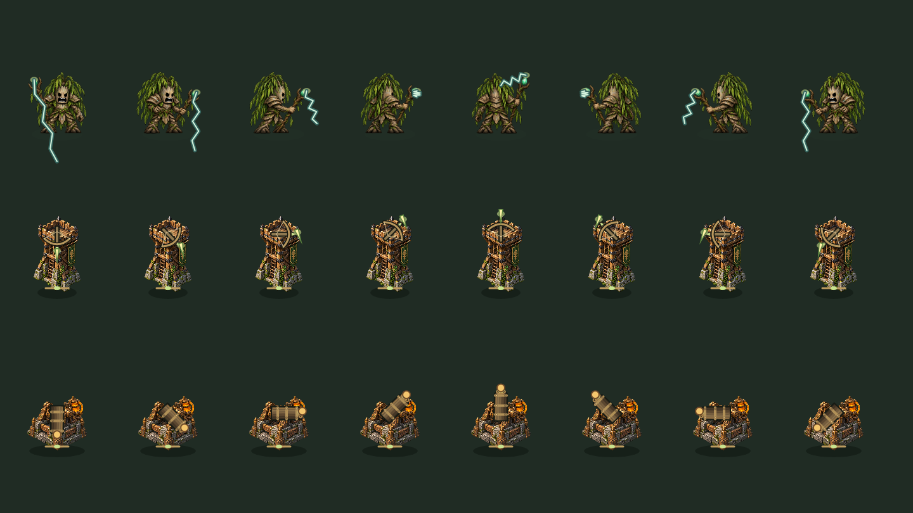

# Earned defenders · v0.10

The roster now grows through campaign play. NFTree access remains the entry requirement; rarity only changes appearances. Unlocking a defender has no currency fee. Planting uses earned Sap; permanent growth, supplies, and continues retain their simulated TREE prices. No wallet or real payment is enabled.

| Defender | Unlock | Role | Sap planting cost |
| --- | --- | --- | ---: |
| Oak | Starter | Root splash | 105 |
| Pine | Starter | Rapid single-target needles | 80 |
| Palm | Clear Emerald Crossing wave 2 | Two-second slow | 90 |
| Cypress | Clear Emerald Crossing wave 4 | Long range with a secondary hit | 120 |
| Mushroom | Clear Emerald Crossing wave 6 | Poison clusters | 100 |
| Archer Watchtower | Protect Emerald Crossing | Range 275, 54 base damage, 1.4s interval; ignores beetle armor | 160 |
| Willow | Earn 4 total best campaign stars | Range 190, 30 base damage, 1.15s interval; chains 65% then 40% damage | 145 |
| Sap Cannon | Protect Sunpetal Meadow | Range 200, 66 base damage, 1.9s interval; 70% splash within 95 | 180 |

These remain test values. Original five defender statistics and waves are unchanged.

## Progress and saves

Milestones count **cleared** waves, not started waves or losses. Best cleared wave per chapter and unlocked defender IDs stay in the forest alongside permanent species levels and best stars. Stars count each chapter's best result once; replay improves that result rather than farming duplicate stars. No claim button or unlock purchase is needed. Cards show requirements and numeric progress, then enable immediately when the milestone is earned.

Original v1/v2 previews had all five guardians available. Migration preserves those five, active defenders, purchased species growth, TREE/Sap, stars, queued pests and living-pest statistics. Missing levels for the three new defenders default to Sapling. Old waves infer cleared progress from the saved phase: a running/paused/defeated wave is not credited as cleared. Successful saved chapters credit all ten waves. Existing earned rosters keep their saved progress. Invalid optional progress fields fall back while retaining active and purchased defenders. All local saves remain editable development data.

New runs and chapter travel preserve unlocks and growth. Reset Preview is the existing confirmed full reset and is the way to experience the two-guardian starting roster on an already played device. It resets funds and purchased growth too; no automatic reset occurs.

## New combat rules

Willow's primary attack uses the selected First/Strongest/Fastest order. Its pulse then picks the nearest unvisited living pest within 95 of the previous hit, for at most two additional targets. Damage falls to 65%, then 40%; each beetle hit applies armor. A defeated primary still anchors the first jump. A visited pest cannot be struck twice by one pulse. Secondary chain events render from the preceding pest and never redirect the guardian's facing.

The Watchtower's primary bolt ignores beetle armor. The Cannon uses normal armor on its primary and on each splash target; splash does not revisit the primary. Both use ordinary cooldowns, targeting orders, TREE growth multipliers, fertilizer, Sap planting and removal refunds. Unlocks do not change rarity privileges or existing defender statistics.

Structure foundations stay fixed. A separate bow or cannon barrel rotates toward the same target as the real attack. Shot origins share the weapon mount and muzzle geometry. The base artwork has no fixed weapon that would leave a second barrel pointing elsewhere.

## Artwork

Built-in image generation produced the three transparent assets below; originals are copied unchanged into the repository. Willow's atlas has 3 growth rows and 5 views; mirrored left views give eight target directions. Runtime alpha isolation selects complete silhouettes and caches recolors. Hand-calibrated staff-tip coordinates live with the existing aiming sockets in art.js.

- [Willow directional atlas](../assets/defenders/willow-aim-v1.png)
- [Watchtower base](../assets/towers/watchtower-base-v1.png)
- [Cannon base](../assets/towers/cannon-base-v1.png)

The original full structure concepts remain gallery portraits. Thorn Bastion and Root Obelisk are still marked Coming later with no build/purchase controls.

This sheet uses the actual canvas artwork and sprites; it is not a browser screenshot.

### Willow generation prompt

Use case: stylized-concept. Asset type: transparent directional game sprite atlas for Canopy Defense. Create ONE atlas with exactly 15 separate full-body poses arranged evenly in THREE ROWS and FIVE COLUMNS on a wide landscape transparent canvas, at least 1536x1024. Each row is the SAME original WILLOW NFTree stump guardian at one growth stage. Row 1 Sapling, row 2 Guardian with weathered wooden shoulder armor, row 3 Ancient with stronger root armor and subtle silver rune accents. Columns left to right: front facing screen down; three-quarter front facing lower right; right profile facing right; three-quarter rear facing upper right; back facing screen up. Anatomically consistent turns, same body/equipment in every column. Subject: mature expressive anthropomorphic WILLOW tree stump warrior with a jagged broken stump head, dark black eyes, stern expressive mouth visible only from front, lean twisted grey-brown bark body, root feet, branch arms, long drooping narrow willow leaves forming a mantle, small moss details, holding a forked branch conductor staff in his right hand aimed in the direction his body faces. A subtle pale teal charged bud at the tip of the staff is the weapon muzzle. Distinct from the supplied palm reference: willow has drooping leaves, grey bark, narrow silhouette, a forked staff, no shield, no palm fan. Style: match the reference's dark ink edges and readable NFTree identity but with rich weathered painterly bark textures, subdued forest greens and slate tones, serious fantasy strategy game atmosphere, no toy gloss, no baby proportions. Scene/background: genuinely transparent with alpha, no shadows connecting sprites, no scenery, no text, no labels, no frame, no watermark. Layout: exactly five figures per row, complete feet and staff tip in every pose, large clear transparent gutters between all figures and around outer edges; nothing crosses cells; each figure self-contained. Reference image only guides NFTree identity and the five-view three-growth atlas layout, not an edit target.

### Watchtower base generation prompt

Use case: stylized-concept. Asset type: one transparent isolated structural base sprite for Canopy Defense. Subject: A tall fortified oak archery watchtower, weathered stone footing, wooden braces and iron bands, small crenellated timber parapet. An EMPTY flat upper platform, NO bow, NO weapon, NO barrel, NO character. Leave the top platform clear: a rotating mounted bow will be drawn by the game. Style: richly textured mature painterly fantasy game art matching the supplied concept reference, serious medieval forest atmosphere, charcoal weathered stone, rough oak, muted bronze, restrained moss and amber. Composition: one isolated structure centered, full base and top visible with generous transparent margins, elevated three-quarter view. Genuinely transparent alpha background, no scenery, no ground shadow outside structure, no text, no frame, no watermark, no duplicate objects. Preserve rich material detail at small game sprite size.

### Cannon base generation prompt

Use case: stylized-concept. Asset type: one transparent isolated structural base sprite for Canopy Defense. Subject: A squat circular weathered stone cannon emplacement, broad oak braced base with hammered bronze bearings, moss and a small amber sap reservoir on the rear. EMPTY central turntable ready for a cannon barrel, NO cannon barrel, NO weapon, NO character. The rotating weapon is drawn separately in the game. Style: richly textured mature painterly fantasy game art matching the supplied concept reference, serious medieval forest atmosphere, charcoal weathered stone, rough oak, muted bronze, restrained moss and amber. Composition: one isolated structure centered, full base and top visible with generous transparent margins, elevated three-quarter view. Genuinely transparent alpha background, no scenery, no ground shadow outside structure, no text, no frame, no watermark, no duplicate objects. Preserve rich material detail at small game sprite size.

## Validation

Nine progression/combat tests cover starter gating across all rarities, exact milestones, defeat/continue boundaries, one-time unlocks, best-star rewards, new saves, original saves, edited optional fields, chain uniqueness/radius/armor, structure damage, growth and currency accounting. Existing attack/facing/priority tests now cover all eight defenders using explicit unlocked fixtures.

A fresh-player deterministic mixed-Sap strategy completes Emerald Crossing at 100 life, Sunpetal Meadow at 100, and Moonlit Marsh at 28, earning all eight without any TREE purchases. The original 15 strategy/chapter audit remains a five-guardian baseline for migrated players. Fixed strategies are reproducible engine examples, not a forecast of human outcomes.

Native canvas QA isolates all 15 Willow silhouettes and two structure bases, and renders all 432 new type/growth/style/direction combinations with finite launch origins. The aiming sheet was visually inspected. JavaScript syntax, module imports and static DOM/asset references are checked.

Browser QA is unavailable in this managed environment because the supported control-browser capability is absent. Actual desktop/mobile layouts, focus and touch interactions need user playtesting.

## Manual playtest

1. On a fresh preview, confirm only Oak and Pine can be selected; attempts through locked hotkeys must not spend Sap or TREE.
2. Clear waves 2, 4 and 6: each card enables once with an unlock notice. Plant the new specialist and check its distinct role.
3. Finish Emerald Crossing: build the Watchtower in a new run and watch its bow aim above/below and left/right.
4. Earn 4 best stars, then use Willow against a cluster. Its staff tip launches the primary pulse; secondary pulses originate at pests and do not turn the character again.
5. Protect Sunpetal Meadow: build the Cannon, change its target priority and watch barrel/muzzle alignment and cluster impacts.
6. Reload, continue and start a new run: earned access and species growth stay. Original played saves retain their five guardians.
7. Check two-column roster cards on a phone, readable locked requirements, labeled build-site buttons and keyboard shortcuts 1–8.
