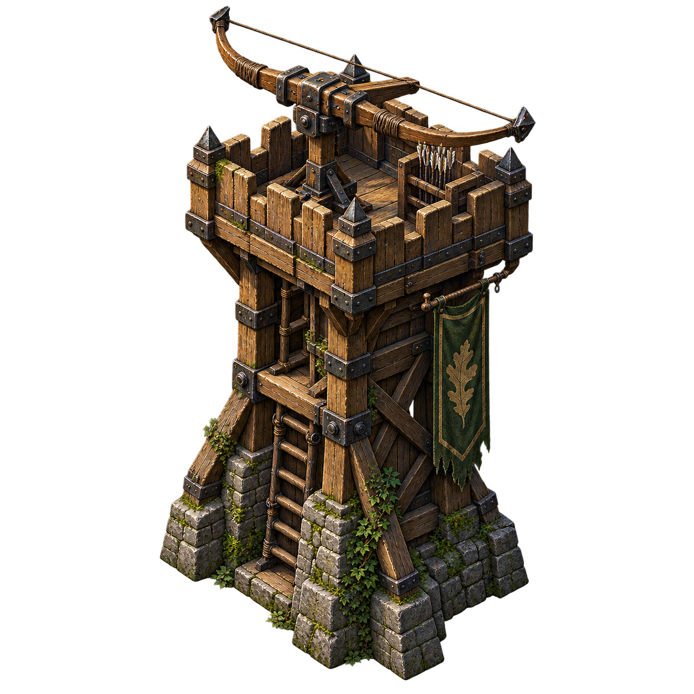
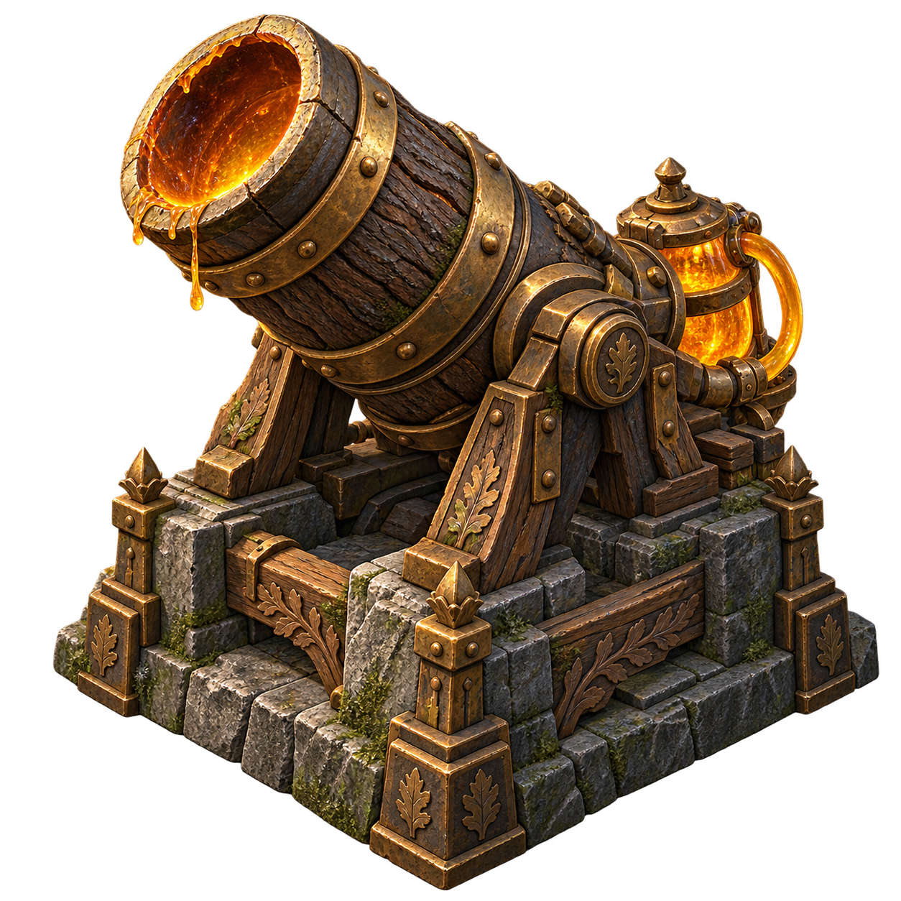
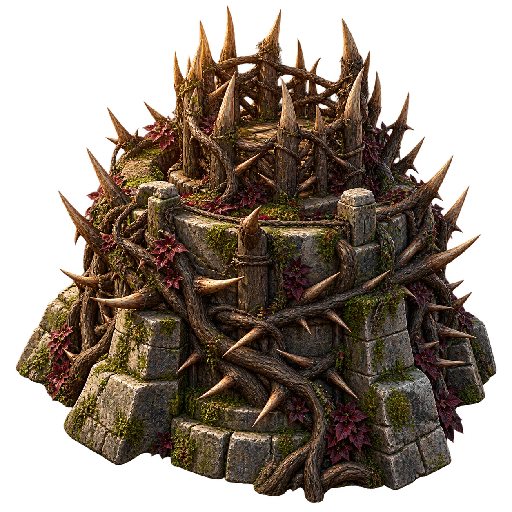
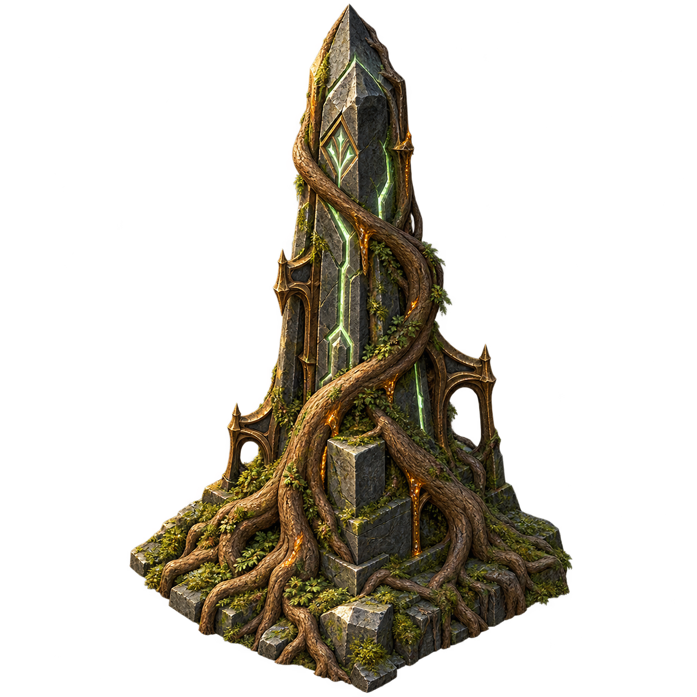

# Future structure tower concepts

These four structures first appeared as **Coming later** concepts in v0.5.1. In v0.10 the Archer Watchtower and Sap Cannon are playable earned unlocks; their original full concepts remain gallery portraits, while new weapon-free bases support independently rotating battlefield weapons. See [earned defenders](earned-defenders.md) for unlocks, test combat statistics, prices, new asset prompts and save rules. Thorn Bastion and Root Obelisk remain future concepts with proposed roles and no build or purchase controls. The notes below record the original gallery integration.

| Structure | Proposed role | Asset |
| --- | --- | --- |
| Archer Watchtower | Long-range defense | `assets/towers/archer-watchtower-v1.png` |
| Sap Cannon | Splash damage | `assets/towers/sap-cannon-v1.png` |
| Thorn Bastion | Slowing thorn patches | `assets/towers/thorn-bastion-v1.png` |
| Root Obelisk | Support nearby guardians | `assets/towers/root-obelisk-v1.png` |

## Art direction and generation

Generated with the built-in image-generation tool, one asset per call, with a transparent background. The original PNG outputs are copied unchanged into the repository. The gallery uses native HTML images and CSS containment to preserve complete silhouettes and transparency. The style follows the accepted mature forest direction: weathered stone, rough oak, bronze, brambles, and restrained magical light.

### Archer Watchtower

Final generation prompt:

> Use case: stylized-concept. Asset type: upcoming tower concept for Canopy Defense, a mature fantasy forest tower-defense game. Style: richly textured painterly game concept art, realistic material detail, readable silhouette, restrained forest greens, charcoal stone, oak brown and muted bronze; dramatic warm upper-left light, grounded serious medieval forest atmosphere. Composition: ONE isolated structure centered in a square canvas, three-quarter elevated isometric view showing front, right side and top; entire base and tallest point visible with generous transparent margins. Scene: genuinely transparent background, only the structure and its small foundation; no scenery, no frame. No text, no logos, no watermark, no UI, no cartoon faces, no preschool shapes, no cute proportions, no duplicated objects. Subject: A tall fortified wooden archery watchtower of rough oak timbers, a weathered grey stone footing, diagonal wooden braces, iron bands, a small crenellated parapet and heavy mounted longbow on the upper platform. Natural leaf shoots and a little moss, dark aged wood. Distinct tall vertical silhouette; no character or person.

### Sap Cannon

Final generation prompt:

> Use case: stylized-concept. Asset type: upcoming tower concept for Canopy Defense, a mature fantasy forest tower-defense game. Style: richly textured painterly game concept art, realistic material detail, readable silhouette, restrained forest greens, charcoal stone, oak brown and muted bronze; dramatic warm upper-left light, grounded serious medieval forest atmosphere. Composition: ONE isolated structure centered in a square canvas, three-quarter elevated isometric view showing front, right side and top; entire base and tallest point visible with generous transparent margins. Scene: genuinely transparent background, only the structure and its small foundation; no scenery, no frame. No text, no logos, no watermark, no UI, no cartoon faces, no preschool shapes, no cute proportions, no duplicated objects. Subject: A squat massive forest artillery cannon, a thick hollow dark oak barrel with hammered bronze hoops angled upward, amber sap glowing faintly inside its muzzle, weathered stone base with broad carved wooden supports, small amber reservoir on the rear. Heavy compact silhouette; no wheels, no character or person.

### Thorn Bastion

Final generation prompt:

> Use case: stylized-concept. Asset type: upcoming tower concept for Canopy Defense, a mature fantasy forest tower-defense game. Style: richly textured painterly game concept art, realistic material detail, readable silhouette, restrained forest greens, charcoal stone, oak brown and muted bronze; dramatic warm upper-left light, grounded serious medieval forest atmosphere. Composition: ONE isolated structure centered in a square canvas, three-quarter elevated isometric view showing front, right side and top; entire base and tallest point visible with generous transparent margins. Scene: genuinely transparent background, only the structure and its small foundation; no scenery, no frame. No text, no logos, no watermark, no UI, no cartoon faces, no preschool shapes, no cute proportions, no duplicated objects. Subject: A low broad defensive bastion made from weathered stone blocks encircled by densely tangled dark bramble roots and sharp long natural thorns, a raised central crown of interlocked thornwood stakes. Moss and a few deep burgundy leaves. Strong broad fortress silhouette; no faces or characters.

### Root Obelisk

Final generation prompt:

> Use case: stylized-concept. Asset type: upcoming tower concept for Canopy Defense, a mature fantasy forest tower-defense game. Style: richly textured painterly game concept art, realistic material detail, readable silhouette, restrained forest greens, charcoal stone, oak brown and muted bronze; dramatic warm upper-left light, grounded serious medieval forest atmosphere. Composition: ONE isolated structure centered in a square canvas, three-quarter elevated isometric view showing front, right side and top; entire base and tallest point visible with generous transparent margins. Scene: genuinely transparent background, only the structure and its small foundation; no scenery, no frame. No text, no logos, no watermark, no UI, no cartoon faces, no preschool shapes, no cute proportions, no duplicated objects. Subject: An ancient tall tapered charcoal-grey stone obelisk wrapped in massive twisting oak roots on a small rooted stone plinth, restrained pale green glowing carved fissures and subtle amber sap seams, moss at the base, irregular worn beveled stone edges. Mysterious elegant support structure silhouette; no faces or characters.

## Integration and verification

- Static semantic section with four articles, descriptive image alternatives, and explicit coming-later labels. It contains no build or purchase controls.
- Placed below the existing game layout, with four columns on wide screens, two below 1000px, and one below 420px. Images are loaded lazily and reserve their display area.
- Existing guardian selection, build sites, combat, economy, and saved progress are unchanged.
- The local server serves only the four named tower assets; other files under that directory remain blocked.
- Required game tests and JavaScript syntax checks pass. PNG decoding, nonempty transparent silhouettes, HTML references, and HTTP image routes are checked.
- Full desktop and mobile browser layout verification remains pending due to the previously observed preview-browser restrictions.

